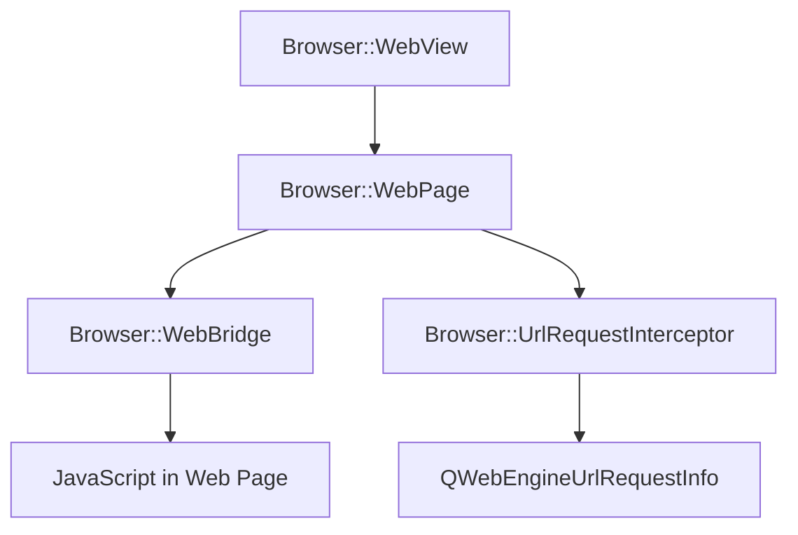

The Browser library provides web rendering capabilities for displaying documentation, handling navigation, and enabling JavaScript communication between C++ and web content.

## Architecture Overview

The browser component is built on Qt WebEngine (Chromium):



## Browser::WebView

Custom web view widget extending `QWebEngineView` with Zeal-specific functionality.

**Location**: `src/libs/browser/webview.h`

### Interface

```cpp
class WebView final : public QWebEngineView
{
public:
    explicit WebView(QWidget *parent = nullptr);
    
    // Zoom management
    int zoomLevel() const;
    void setZoomLevel(int level);
    static const QVector<int> &availableZoomLevels();
    static int defaultZoomLevel();
    
    bool eventFilter(QObject *watched, QEvent *event) override;
    
public slots:
    void zoomIn();
    void zoomOut();
    void resetZoom();
    
signals:
    void zoomLevelChanged();
    
protected:
    QWebEngineView *createWindow(QWebEnginePage::WebWindowType type) override;
    void contextMenuEvent(QContextMenuEvent *event) override;
};
```

### Key Features

#### Zoom Control

From `src/libs/browser/webview.h:20-31`:

```cpp
int zoomLevel() const;
void setZoomLevel(int level);
static const QVector<int> &availableZoomLevels();
static int defaultZoomLevel();

public slots:
    void zoomIn();
    void zoomOut();
    void resetZoom();
```

Provides discrete zoom levels for consistent documentation reading experience.

#### Event Handling

From `src/libs/browser/webview.h:41-42`:

```cpp
bool handleMouseReleaseEvent(QMouseEvent *event);
bool handleWheelEvent(QWheelEvent *event);
```

Custom event handling for:

- **Mouse events**: Middle-click for opening links in new tabs
- **Wheel events**: Ctrl+Wheel for zooming

#### Context Menu

From `src/libs/browser/webview.h:44-46`:

```cpp
QMenu *m_contextMenu = nullptr;
QUrl m_clickedLink;
int m_zoomLevel = 0;
```

Custom context menu with Zeal-specific actions:

- Open link in new tab
- Copy link address
- Inspect element (in debug builds)

#### Window Creation

```cpp
QWebEngineView *createWindow(QWebEnginePage::WebWindowType type) override;
```

Handles requests to open new windows/tabs from JavaScript or link targets.

## Browser::WebPage

Custom web page implementation with navigation control and JavaScript integration.

**Location**: `src/libs/browser/webpage.h`

### Interface

```cpp
class WebPage final : public QWebEnginePage
{
public:
    explicit WebPage(QObject *parent = nullptr);
    
protected:
    bool acceptNavigationRequest(const QUrl &requestUrl, 
                                 NavigationType type, 
                                 bool isMainFrame) override;
    void javaScriptConsoleMessage(QWebEnginePage::JavaScriptConsoleMessageLevel level,
                                  const QString &message,
                                  int lineNumber,
                                  const QString &sourceId) override;
};
```

### Navigation Control

From `src/libs/browser/webpage.h:21`:

```cpp
bool acceptNavigationRequest(const QUrl &requestUrl, 
                             NavigationType type, 
                             bool isMainFrame) override;
```

Controls which navigation requests are allowed:

- **Local documentation**: Always allowed
- **External links**: Subject to user preference (Settings::ExternalLinkPolicy)
- **JavaScript navigation**: Validated before execution

### JavaScript Console

From `src/libs/browser/webpage.h:22`:

```cpp
void javaScriptConsoleMessage(QWebEnginePage::JavaScriptConsoleMessageLevel level,
                              const QString &message,
                              int lineNumber,
                              const QString &sourceId) override;
```

Captures JavaScript console messages for debugging and error reporting.

## Browser::WebBridge

Bridge between C++ code and JavaScript in web pages.

**Location**: `src/libs/browser/webbridge.h`

### Interface

```cpp
class WebBridge final : public QObject
{
    Q_OBJECT
    Q_DISABLE_COPY_MOVE(WebBridge)
    Q_PROPERTY(QString AppVersion READ appVersion CONSTANT)
public:
    explicit WebBridge(QObject *parent = nullptr);
    
signals:
    void actionTriggered(const QString &action);
    
public slots:
    Q_INVOKABLE void openShortUrl(const QString &key);
    Q_INVOKABLE void triggerAction(const QString &action);
    
private:
    QString appVersion() const;
};
```

### JavaScript Integration

The WebBridge is exposed to JavaScript through Qt's WebChannel mechanism.

#### From JavaScript

```javascript
// Access from JavaScript (when WebChannel is set up)
window.zeal.openShortUrl('key');
window.zeal.triggerAction('action-name');

// Read properties
console.log(window.zeal.AppVersion);
```

#### Q_INVOKABLE Methods

From `src/libs/browser/webbridge.h:24-25`:

```cpp
Q_INVOKABLE void openShortUrl(const QString &key);
Q_INVOKABLE void triggerAction(const QString &action);
```

These methods can be called directly from JavaScript:

- **openShortUrl**: Opens documentation using short URL keys
- **triggerAction**: Triggers application actions from web content

#### Properties

From `src/libs/browser/webbridge.h:16`:

```cpp
Q_PROPERTY(QString AppVersion READ appVersion CONSTANT)
```

Exposes application version to JavaScript for feature detection.

### Signals

From `src/libs/browser/webbridge.h:21`:

```cpp
signals:
    void actionTriggered(const QString &action);
```

Emitted when JavaScript requests an action, allowing the main application to respond.

## Browser::UrlRequestInterceptor

Intercepts and modifies URL requests before they're sent.

**Location**: `src/libs/browser/urlrequestinterceptor.h`

### Interface

```cpp
class UrlRequestInterceptor final : public QWebEngineUrlRequestInterceptor
{
public:
    UrlRequestInterceptor(QObject *parent = nullptr);
    void interceptRequest(QWebEngineUrlRequestInfo &info) override;
    
private:
    void blockRequest(QWebEngineUrlRequestInfo &info);
};
```

### Request Interception

From `src/libs/browser/urlrequestinterceptor.h:19`:

```cpp
void interceptRequest(QWebEngineUrlRequestInfo &info) override;
```

Interception enables:

- **Blocking unwanted requests**: Ads, tracking, external resources
- **URL rewriting**: Redirecting to local HTTP server
- **Security controls**: Preventing unauthorized access
- **Resource optimization**: Blocking unnecessary assets

### Use Cases

1. **Local Documentation Serving**
   - Rewrite docset:// URLs to http://localhost:port/
   - Enable proper CORS and resource loading

2. **Privacy Protection**
   - Block external tracking scripts
   - Prevent analytics beacons

3. **Resource Control**
   - Block large unnecessary resources
   - Optimize page load times

## WebEngine Integration

### Profile Management

Zeal uses Qt WebEngine profiles to manage:

- **Persistent storage**: Cookies, cache, local storage
- **HTTP user agent**: Custom user agent string
- **Request interceptor**: URL filtering and rewriting

### JavaScript Injection

Zeal can inject JavaScript into pages for:

- Setting up WebChannel communication
- Applying custom styling
- Adding navigation enhancements
- Implementing keyboard shortcuts

### Settings

Web engine settings configured by Zeal:

```cpp
// Font settings from Core::Settings
settings()->setFontFamily(QWebEngineSettings::StandardFont, defaultFontFamily);
settings()->setFontFamily(QWebEngineSettings::SerifFont, serifFontFamily);
settings()->setFontSize(QWebEngineSettings::DefaultFontSize, defaultFontSize);

// Feature flags
settings()->setAttribute(QWebEngineSettings::JavascriptEnabled, jsEnabled);
settings()->setAttribute(QWebEngineSettings::LocalContentCanAccessRemoteUrls, false);
```

## Custom CSS Support

Users can apply custom CSS to all documentation:

```cpp
// From Core::Settings
QString customCssFile;
```

The CSS is injected into each page to:

- Override default documentation styling
- Implement dark mode
- Adjust typography
- Hide unwanted elements

## Search Integration

The browser component integrates with search:

### URL Format

Documentation URLs include search terms for highlighting:

```
http://localhost:port/docset/page.html#anchor?searchTerm=query
```

### Highlight on Navigate

When `Settings::isHighlightOnNavigateEnabled` is true:

- Search terms are extracted from URL
- JavaScript is injected to highlight matches
- Page scrolls to first match

## Navigation History

WebView inherits Qt WebEngine's history management:

```cpp
// Available through QWebEngineView
history()->back();
history()->forward();
history()->goToItem(item);
```

History is preserved per-tab and persists across application restarts.

## Developer Tools

In debug builds, the web inspector is available:

```cpp
// Enable developer tools
page()->settings()->setAttribute(
    QWebEngineSettings::DeveloperExtrasEnabled, true);
```

Accessible via context menu "Inspect Element" option.

## See Also

- [Core Component](./core.mdx) - HTTP server for documentation serving
- [UI Component](./ui.mdx) - Browser tab management
- [Registry Component](./registry.mdx) - Search result URLs
