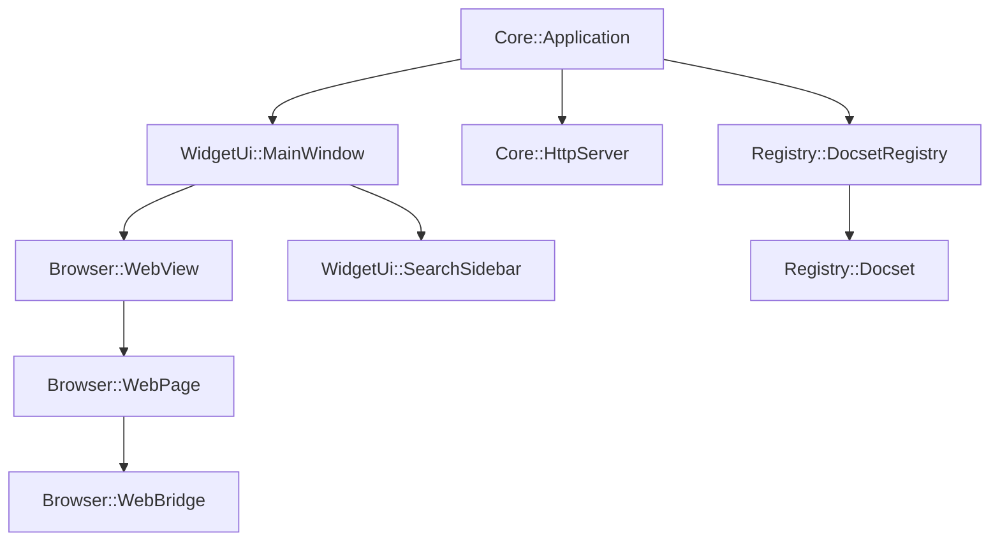

Zeal is built with a modular architecture that separates concerns into distinct libraries, each responsible for specific functionality. The application is built on the Qt framework, leveraging its cross-platform capabilities and robust widget system.

## Core Components

Zeal's architecture consists of five main components:

### 1. Core

The **Core** library (`src/libs/core/`) provides the foundation of the application:

- **Application**: Central singleton managing the application lifecycle
- **Settings**: Configuration management and persistence
- **HttpServer**: Local HTTP server for serving documentation files
- **FileManager**: File system operations
- **Extractor**: Archive extraction for docset installation

### 2. Registry

The **Registry** library (`src/libs/registry/`) manages documentation sets:

- **DocsetRegistry**: Collection management for all installed docsets
- **Docset**: Individual documentation set representation
- **SearchQuery**: Query parsing and filtering
- **SearchResult**: Search result representation with scoring
- Uses SQLite for indexing and fast symbol lookup

### 3. Browser

The **Browser** library (`src/libs/browser/`) handles documentation rendering:

- **WebView**: Custom QWebEngineView for displaying documentation
- **WebPage**: Page-level customization and navigation control
- **WebBridge**: JavaScript bridge for C++/JS communication
- **UrlRequestInterceptor**: Request filtering and redirection

### 4. UI

The **UI** library (`src/libs/ui/`) provides the graphical interface:

- **MainWindow**: Main application window with tab management
- **SearchSidebar**: Search interface and results display
- **SettingsDialog**: Configuration interface
- **DocsetsDialog**: Docset management and download interface

### 5. Util

The **Util** library (`src/libs/util/`) offers shared utilities:

- **SQLiteDatabase**: SQLite database wrapper
- **Fuzzy**: Fuzzy search implementation
- **Plist**: Property list parser for Dash docset metadata
- **Humanizer**: Human-readable formatting utilities

## Component Interaction

The architecture follows a hierarchical design:

1. **Core::Application** serves as the central hub, instantiating and coordinating all major components
2. **WidgetUi::MainWindow** manages the user interface and user interactions
3. **Registry::DocsetRegistry** maintains the docset collection and handles search operations
4. **Browser::WebView** renders documentation pages and handles navigation
5. **Core::HttpServer** serves local documentation files through HTTP

## Qt Framework Integration

Zeal leverages several Qt modules:

- **Qt Widgets**: Traditional desktop UI components
- **Qt WebEngine**: Chromium-based web rendering
- **Qt Network**: HTTP client for downloading docsets
- **Qt Core**: Foundation classes (signals/slots, threading, file I/O)

The application uses Qt's signal-slot mechanism for loose coupling between components, enabling clean separation of concerns and testability.

## Threading Model

Zeal uses Qt's threading capabilities for background operations:

- **Extractor** runs in a dedicated thread (`m_extractorThread`) to avoid blocking the UI during docset installation
- **Search operations** can be performed asynchronously with cancellation tokens
- **HTTP server** runs in a separate thread using `std::future`

## Next Steps

- [Core Component Details](./core.mdx)
- [Registry Component Details](./registry.mdx)
- [Browser Component Details](./browser.mdx)
- [UI Component Details](./ui.mdx)
