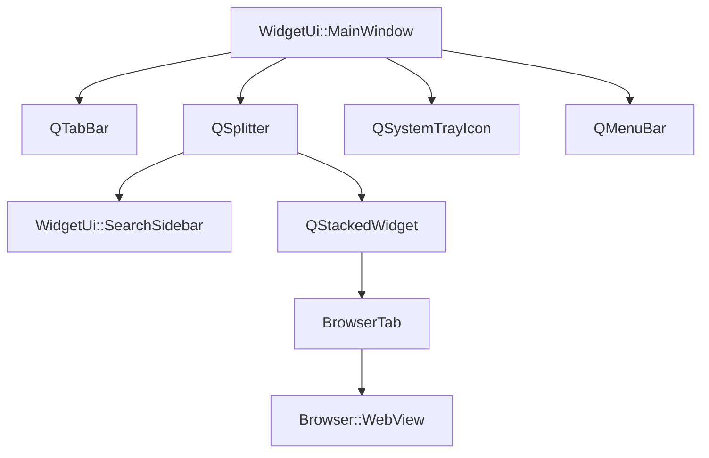

The UI library provides the graphical user interface for Zeal, built entirely with Qt Widgets for native look and feel across platforms.

## Component Hierarchy



## WidgetUi::MainWindow

The main application window managing tabs, search, and navigation.

**Location**: `src/libs/ui/mainwindow.h`

### Interface

```cpp
class MainWindow : public QMainWindow
{
public:
    explicit MainWindow(Core::Application *app, QWidget *parent = nullptr);
    
    void search(const Registry::SearchQuery &query);
    void bringToFront();
    BrowserTab *createTab();
    
public slots:
    void toggleWindow();
    
signals:
    void currentTabChanged();
    
protected:
    void changeEvent(QEvent *event) override;
    void closeEvent(QCloseEvent *event) override;
    bool eventFilter(QObject *object, QEvent *event) override;
    void keyPressEvent(QKeyEvent *keyEvent) override;
};
```

### Member Components

From `src/libs/ui/mainwindow.h:82-105`:

```cpp
Core::Application *m_application = nullptr;
Core::Settings *m_settings = nullptr;
Browser::WebBridge *m_webBridge = nullptr;

QxtGlobalShortcut *m_globalShortcut = nullptr;

QMenuBar *m_menuBar = nullptr;
QTabBar *m_tabBar = nullptr;

QSplitter *m_splitter = nullptr;
QStackedWidget *m_webViewStack = nullptr;

// Actions
QAction *m_quitAction = nullptr;
QAction *m_showDocsetManagerAction = nullptr;
QAction *m_showPreferencesAction = nullptr;
#ifndef Q_OS_MACOS
QAction *m_showMenuBarAction = nullptr;
#endif

QSystemTrayIcon *m_trayIcon = nullptr;
```

### Tab Management

From `src/libs/ui/mainwindow.h:64-75`:

```cpp
private slots:
    void closeTab(int index = -1);
    void moveTab(int from, int to);
    void duplicateTab(int index);
    
private:
    void addTab(BrowserTab *tab, int index = -1);
    BrowserTab *currentTab() const;
    BrowserTab *tabAt(int index) const;
```

Supports:

- **Multiple tabs**: Each with independent browsing history
- **Tab reordering**: Drag and drop support
- **Tab duplication**: Copy current tab state
- **Tab closing**: With confirmation for multiple tabs

### Layout Structure

1. **QMenuBar** (`m_menuBar`): Top menu bar (hidden on macOS by default)
2. **QTabBar** (`m_tabBar`): Tab switcher
3. **QSplitter** (`m_splitter`): Resizable split between sidebar and content
   - Left: SearchSidebar
   - Right: QStackedWidget with BrowserTabs

### Window State

Window geometry and splitter positions are persisted:

```cpp
// From Core::Settings
QByteArray windowGeometry;
QByteArray verticalSplitterGeometry;
QByteArray tocSplitterState;
```

Restored on application startup for consistent user experience.

### Global Shortcuts

From `src/libs/ui/mainwindow.h:87`:

```cpp
QxtGlobalShortcut *m_globalShortcut = nullptr;
```

Enables system-wide keyboard shortcut to show/hide Zeal, even when the application is minimized or hidden.

### System Tray Integration

From `src/libs/ui/mainwindow.h:77-78,105`:

```cpp
void createTrayIcon();
void removeTrayIcon();
QSystemTrayIcon *m_trayIcon = nullptr;
```

Provides:

- Tray icon with menu
- Minimize to tray option
- Quick access to search
- Application state indicator

## WidgetUi::SearchSidebar

Search interface with results display and table of contents.

**Location**: `src/libs/ui/searchsidebar.h`

### Interface

```cpp
class SearchSidebar final : public Sidebar::View
{
public:
    explicit SearchSidebar(QWidget *parent = nullptr);
    SearchSidebar *clone(QWidget *parent = nullptr) const;
    
    Registry::SearchModel *pageTocModel() const;
    
signals:
    void activated();
    void navigationRequested(const QUrl &url);
    
public slots:
    void focusSearchEdit(bool clear = false);
    void search(const Registry::SearchQuery &query);
};
```

### Components

From `src/libs/ui/searchsidebar.h:61-75`:

```cpp
SearchEdit *m_searchEdit = nullptr;
bool m_pendingSearchEditFocus = false;

// Index and search results tree view
QTreeView *m_treeView = nullptr;
QModelIndexList m_expandedIndexList;
int m_pendingVerticalPosition = 0;
Registry::SearchModel *m_searchModel = nullptr;

// TOC list view
QListView *m_pageTocView = nullptr;
Registry::SearchModel *m_pageTocModel = nullptr;

QSplitter *m_splitter = nullptr;
QTimer *m_delayedNavigationTimer = nullptr;
```

### Layout

```
┌─────────────────────────┐
│   [Search Input]        │
├─────────────────────────┤
│                         │
│   QTreeView             │
│   (Search Results)      │
│                         │
├─────────────────────────┤ ← QSplitter
│   QListView             │
│   (Page TOC)            │
└─────────────────────────┘
```

### Search Edit

Custom search input widget with:

- Auto-completion using docset keywords
- Query syntax hints
- Search history
- Clear button

### Results Tree View

Displays search results in a tree structure:

- Grouped by docset
- Expandable/collapsible groups
- Custom delegate for rich rendering
- Keyboard navigation support

### Table of Contents

Shows current page TOC:

- Extracted from page structure
- Click to jump to section
- Updates automatically on navigation
- Collapsible via splitter

### Delayed Navigation

From `src/libs/ui/searchsidebar.h:75`:

```cpp
QTimer *m_delayedNavigationTimer = nullptr;
```

Implements delayed navigation when using keyboard:

- Arrow keys browse results without navigating
- Timer triggers navigation after brief pause
- Reduces unnecessary page loads
- Improves keyboard navigation experience

## WidgetUi::SettingsDialog

Configuration interface for all application settings.

**Location**: `src/libs/ui/settingsdialog.h`

### Interface

```cpp
class SettingsDialog : public QDialog
{
public:
    explicit SettingsDialog(QWidget *parent = nullptr);
    
public slots:
    void chooseCustomCssFile();
    void chooseDocsetStoragePath();
    
private:
    void loadSettings();
    void saveSettings();
    
private:
    Ui::SettingsDialog *ui = nullptr;
};
```

### Settings Categories

The dialog uses a tabbed interface with categories:

1. **General**
   - Startup behavior
   - System tray options
   - Global shortcuts
   - Update checking

2. **Search**
   - Fuzzy search toggle
   - Docset path configuration

3. **Content**
   - Font configuration
   - Appearance (light/dark/auto)
   - Custom CSS file
   - External link policy
   - Smooth scrolling
   - Highlight on navigate

4. **Network**
   - Proxy configuration
   - SSL error handling

### UI Definition

The dialog uses Qt Designer UI file:

- **settingsdialog.ui**: Visual layout definition
- **Ui::SettingsDialog**: Generated UI class

Allows rapid iteration on interface design without code changes.

## WidgetUi::DocsetsDialog

Docset management and download interface.

**Location**: `src/libs/ui/docsetsdialog.h`

### Interface

```cpp
class DocsetsDialog : public QDialog
{
public:
    explicit DocsetsDialog(Core::Application *app, QWidget *parent = nullptr);
    
private slots:
    void addDashFeed();
    void updateSelectedDocsets();
    void updateAllDocsets();
    void removeSelectedDocsets();
    void updateDocsetFilter(const QString &filterString);
    void downloadSelectedDocsets();
    void downloadCompleted();
    void downloadProgress(qint64 received, qint64 total);
    void extractionCompleted(const QString &filePath);
    void extractionError(const QString &filePath, const QString &errorString);
    void extractionProgress(const QString &filePath, qint64 extracted, qint64 total);
    void loadDocsetList();
};
```

### Tabs

#### Installed Tab

- Lists installed docsets
- Shows version and size
- Update indicator
- Remove button
- Bulk update option

#### Available Tab

- Lists all available docsets
- Search/filter functionality
- Download button
- Version information
- Download progress

### Data Management

From `src/libs/ui/docsetsdialog.h:77-81`:

```cpp
Util::CaseInsensitiveMap<Registry::DocsetMetadata> m_availableDocsets;
QMap<QString, Registry::DocsetMetadata> m_userFeeds;
QHash<QString, QTemporaryFile *> m_tmpFiles;
```

- **m_availableDocsets**: Downloaded from zealdocs.org
- **m_userFeeds**: User-added Dash feeds
- **m_tmpFiles**: Temporary files during download

### Download Management

From `src/libs/ui/docsetsdialog.h:75,92-93`:

```cpp
QList<QNetworkReply *> m_replies;
void cancelDownloads();
QNetworkReply *download(const QUrl &url);
```

Supports:

- Multiple concurrent downloads
- Progress tracking per docset
- Cancellation support
- Automatic extraction after download

## Custom Delegates

### SearchItemDelegate

**Location**: `src/libs/ui/searchitemdelegate.h`

Custom item delegate for search results:

- Symbol type icon
- Symbol name with match highlighting
- Docset name badge
- Custom colors and fonts

### DocsetListItemDelegate

**Location**: `src/libs/ui/docsetlistitemdelegate.h`

Custom item delegate for docset lists:

- Docset icon
- Name and description
- Version information
- Update indicator
- Download progress bar

## BrowserTab

**Location**: `src/libs/ui/browsertab.h`

Container for a browser view with additional UI:

```cpp
class BrowserTab final : public QWidget
{
public:
    explicit BrowserTab(Browser::WebBridge *webBridge, QWidget *parent = nullptr);
    
    Browser::WebView *webView() const;
    // Additional tab-specific functionality
};
```

Contains:

- WebView widget
- Search toolbar (find in page)
- Loading indicator

## SidebarViewProvider

**Location**: `src/libs/ui/sidebarviewprovider.h`

Provides sidebar views for tab system:

```cpp
class SidebarViewProvider : public QObject
{
public:
    explicit SidebarViewProvider(MainWindow *mainWindow, QObject *parent = nullptr);
    // Creates and manages sidebar views per tab
};
```

Each tab can have its own sidebar state (search results, TOC, etc.).

## Qt Widgets Usage

Zeal uses Qt Widgets extensively:

- **QMainWindow**: Application window with dock, menu, status bar support
- **QSplitter**: Resizable panes
- **QTabBar**: Tab management
- **QTreeView/QListView**: Model-view architecture for data display
- **QDialog**: Modal dialogs
- **QMenu/QMenuBar**: Application menus
- **QAction**: User actions with shortcuts
- **QSystemTrayIcon**: System tray integration

## Keyboard Navigation

Extensive keyboard support throughout:

- **Ctrl+K / Cmd+K**: Focus search
- **Ctrl+T / Cmd+T**: New tab
- **Ctrl+W / Cmd+W**: Close tab
- **Alt+Left/Right**: Navigate history
- **Ctrl+F / Cmd+F**: Find in page
- **Esc**: Clear search, close dialogs
- Custom shortcuts configurable in settings

## Accessibility

Qt Widgets provide built-in accessibility:

- Screen reader support through Qt Accessibility API
- Keyboard navigation for all functions
- Focus indicators
- Tooltips and status messages

## Platform Integration

### macOS

- Native menu bar integration
- Dock icon with menu
- Native dialogs for file selection

### Windows

- Taskbar integration
- Jump list support
- Native file dialogs

### Linux

- Desktop environment integration
- System tray support
- Standard dialogs

## See Also

- [Browser Component](./browser.mdx) - Web view integration
- [Registry Component](./registry.mdx) - Search models
- [Core Component](./core.mdx) - Settings management
